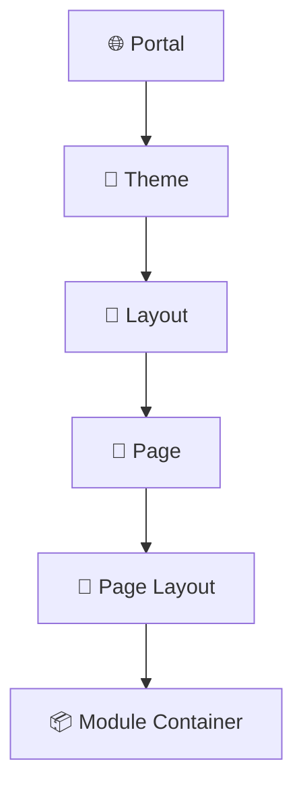
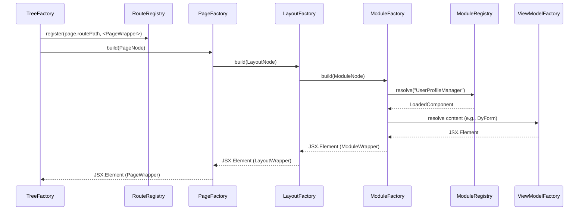

# Skylynx Network
> Client Website for Skylynx Network.
> The website will
> This client app will also have a mobile version.

## ✅ What is the Skylynx Network
Skylynx Network is the foundation platform powering all Portals within the Skylynx Cloud Ecosystem. It handles:
- 🧾 Centralized payment processing
- 👥 User authentication and registration
- 🔗 API service connections
- 💵 Monetization and licensing of services across tenant Portals

Each client Portal communicates with the Skylynx Core services.

---

## ✅ Client Application Design

### 📁 Folder Structure
- `/components`: Shared UI components (buttons, wrappers, theme-based styles)
- `/modules`: Functional UI modules (GalleryView, ProfileManager, DashboardWidgets)
- `/theme`: Global styles and themes
- `/pages`: Route-based page components (Home, About, Auth, Dashboard)
- `/factories`: ViewModel, module, and layout builders for runtime rendering

### 📐 Component Patterns
- Reusable components belong in `/components` only if shared globally
- Pages and Module logic (state, API, settings) must be scoped to `/modules` or `/pages`
- Each module uses `ModuleWrapper.tsx` for standardized behavior:
  - Expand/Collapse
  - Settings Dialog
  - Title Handling

### 🧠 Module Strategy
We are transitioning all major UI features (e.g., Home, AboutUs, UserProfile, Auth) into **Modular Components**, structured for reuse across Portals.

Each module will:
- Use `ModuleWrapper`
- Receive `settings` prop implementing `SkylynxModuleSettings`
- Expose configuration through a dynamic settings dialog

> ❗ Only components without state or API (like Buttons, Labels, Containers) remain in the `/components` library.

### 🔧 Settings Dialog
All modules support a `SkylynxModuleSettings` config interface (title, showTitle, layoutVariant, etc.). These are editable via a dynamic dialog using `ModuleSettingsDialog`.

---

## ✅ Portal Builder Design
Below outlines the hierarchy and flow of how a Portal is constructed within the Skylynx System.



Each layer is driven by Protos metadata. Templates link to SPs for rendering and configuration.

---

## ✅ Client Runtime Factory Architecture

The Skylynx Client uses a modular factory system to render portals dynamically based on metadata from the backend.

### 🔝 1. PortalFactory (Top-Level Builder)
| Role | Description |
|------|-------------|
| `PortalFactory` | Entry point for full portal rendering — layout, pages, modules |
| Builds | `PageFactory`, `ModuleFactory`, `ViewModelContentBuilderFactory` |

### 🧱 2. PageFactory
| Role | Description |
|------|-------------|
| `PageFactory` | Builds layout shell using `PortalPageModel` and `PortalLayoutModel` |
| Populates | Layout regions with module containers |

### 📦 3. ModuleFactory (Per Region Slot)
| Role | Description |
|------|-------------|
| `ModuleFactory` | Injects modules like `UserProfileManager`, `GalleryListView` into containers |
| Wraps | Each module in a `ModuleWrapper` with metadata and settings |

### 🏗️ 4. ViewModelContentBuilderFactory
| Role | Description |
|------|-------------|
| `ViewModelContentBuilderFactory` | Orchestrates rendering of layout- or form-based module content |
| Supports | Sections, Widgets, DyForms, Charts, Tabs, etc. |

### 🧩 5. DyFormFactory (Form Renderer)
| Role | Description |
|------|-------------|
| `DyFormFactory` | Converts `DyFormViewModel.sections` into actual forms using `DynamicFormRenderer` |
| Handles | Layouts, nested sections, validation, conditional visibility |

### 🎨 ThemeFactory (Theme Resolver)
| Role | Description |
|------|-------------|
| `ThemeFactory` | Resolves themes/styles per Portal, Layout, or Module based on metadata |
| Injects | Styled container wrappers (PortalShell, LayoutShell, ModuleShell) |
| Enables | Dynamic theming, white labeling, and UX separation by tenant |

---

## ✅ Registry Pattern Overview

Skylynx uses registries to dynamically resolve modules and routes at runtime.

### 📚 ModuleRegistry
- Stores key → component mappings for all dynamic modules.
- Loaded at startup or lazy-registered via API.
- Used in `ModuleFactory`:
```ts
const Component = ModuleRegistry.get("UserProfileManager");
```

### 🧭 RouteRegistry
- Maintains dynamic route → element mappings.
- Populated by `TreeFactory` when processing PageNodes:
```ts
RouteRegistry.register("/dashboard", <PageWrapper>{...}</PageWrapper>);
```
- Used at app root to inject all dynamic routes into `<Routes>` component.

---

## ✅ Route Handling and Injection

### RouteWrapper Component (Selected Strategy)
Each PageNode is rendered into a `<Route>` component during tree traversal. Instead of storing routes globally, we embed them directly in the JSX return value from `TreeFactory`.

### 📦 `RouteWrapper`
Wraps the `PageWrapper` and ties it to the expected `routePath`.

```tsx
<Route path={page.routePath} element={<PageWrapper>{...}</PageWrapper>} />
```

### Embedded in Factory
```tsx
return (
  <RouteWrapper path={node.template.routePath}>
    <PageWrapper>{...layoutContent}</PageWrapper>
  </RouteWrapper>
);
```

> ❗This supports **code splitting**, **context-aware rendering**, and **page transitions**.

---

## ✅ Smart UI Containers
Each major node type in the tree has a matching smart UI container:

| Container         | Description |
|------------------|-------------|
| `PortalWrapper`   | Theme-aware shell around entire portal rendering |
| `PageWrapper`     | Handles route-bound page metadata, title, etc. |
| `LayoutWrapper`   | Wraps layout regions (main/sidebar/footer), handles spacing |
| `ModuleWrapper`   | Adds settings dialog, collapsible title, and runtime module control |

These containers:
- Take in `settings` and `children`
- Wrap children with behavioral or presentational logic
- Support per-tenant styles via `ThemeFactory`

---

## ✅ Portal Runtime Configuration Models

| Model                 | Description                                                     |
| --------------------- | --------------------------------------------------------------- |
| `PortalPageModel`     | Defines route, layout, and visibility for a page.               |
| `PortalLayoutModel`   | Lists regions (e.g., `main`, `footer`) for positioning modules. |
| `PortalModuleModel`   | Metadata about available modules.                               |
| `PortalPageModuleMap` | Mapping of module to page + region + order.                     |
| `PortalPageViewModel` | Combines page, layout, modules, navigation for rendering.       |

---

## ✅ Factory Execution Flow: Route & Module Registry Integration



---

## ✅ Example Flow: GalleryListView on Dashboard

1. Portal config includes `GalleryListView` in `main` region.
2. PageFactory builds layout → inserts ModuleFactory calls into each region.
3. ModuleFactory loads `GalleryListView` via registry.
4. Wrapped with `ModuleWrapper`, passing props from `PortalPageModuleMap`.
5. Component renders.
6. Admin clicks settings → `ModuleSettingsDialog` shown.
7. Settings saved and module re-renders.

---

## ✅ What’s Next
- Scaffold top-level factories: `PortalFactory`, `PageFactory`, `ModuleFactory`
- Implement `ViewModelContentBuilderFactory` → integrate DyForm modules
- Build shared `DyFormFactory`, `FieldRenderer`, `useDynamicFormState`
- Add Theme-aware shells: `PortalWrapper`, `LayoutWrapper`, `PageWrapper`
- Enable RouteWrapper usage during TreeFactory traversal

---

## ✅ Summary
The Skylynx Client enables **portal-specific customization**, **metadata-driven rendering**, and **runtime modularity**. By combining factory-based composition with template metadata, we achieve:

- High extensibility
- Configurable layout + UX per tenant
- Route-aware tree rendering
- Thematic styling via `ThemeFactory`
- Reuse across platforms (desktop/web/mobile)
