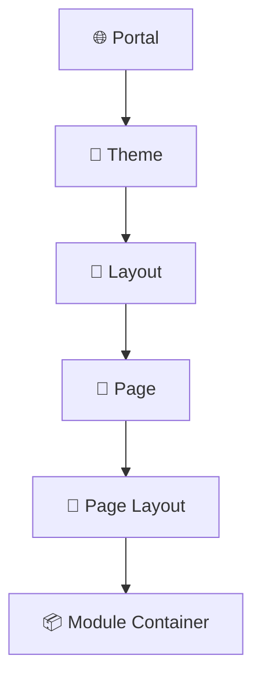
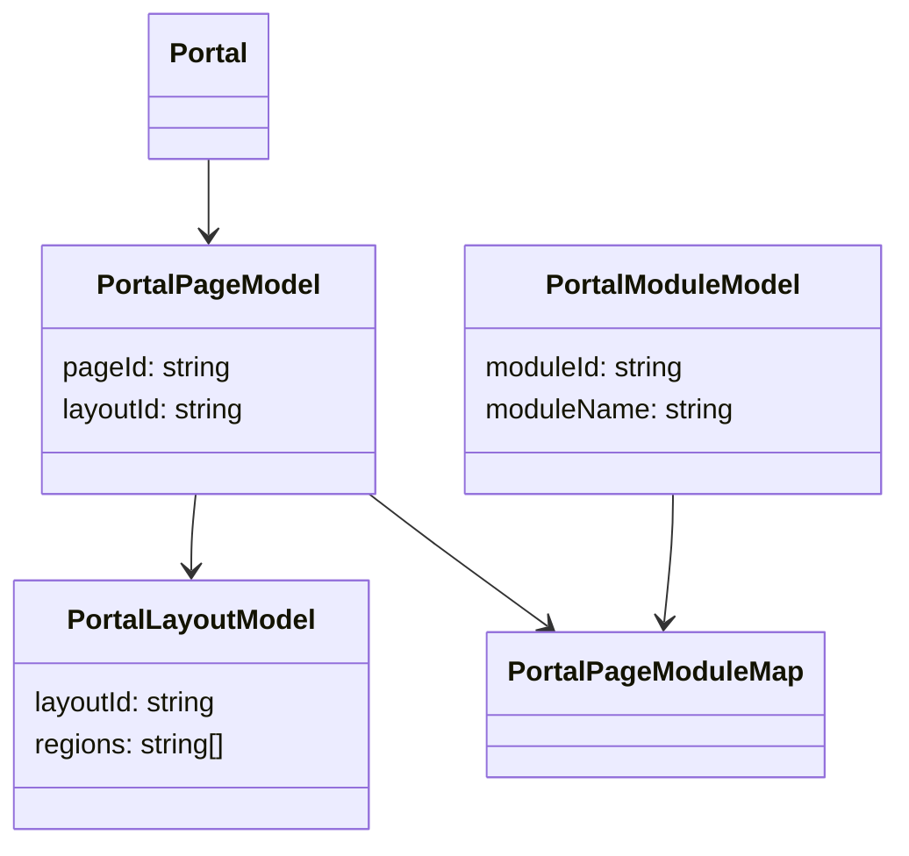
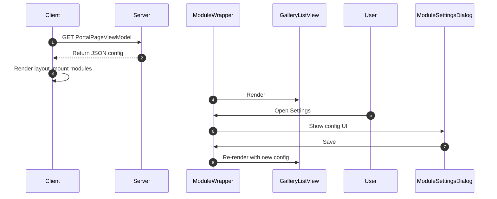

# Skylynx Network
> Client Website for Skylynx Network.
> The website will
> This client app will also have a mobile version.

## ✅ What is the Skylynx Network
Skylynx Network is the foundation platform powering all Portals within the Skylynx Cloud Ecosystem. It handles:
- 🧾 Centralized payment processing
- 👥 User authentication and registration
- 🔗 API service connections
- 💵 Monetization and licensing of services across tenant Portals

Each client Portal communicates with the Skylynx Core services.

---

## ✅ Client Application Design

### 📁 Folder Structure
- `/components`: Shared UI components (buttons, wrappers, theme-based styles)
- `/modules`: Functional UI modules (GalleryView, ProfileManager, DashboardWidgets)
- `/theme`: Global styles and themes
- `/pages`: Route-based page components (Home, About, Auth, Dashboard)

### 📐 Component Patterns
- Reusable components belong in `/components` only if shared globally
- Pages and Module logic (state, API, settings) must be scoped to `/modules` or `/pages`
- Each module uses `ModuleWrapper.tsx` for standardized behavior:
  - Expand/Collapse
  - Settings Dialog
  - Title Handling

### 🧠 Module Strategy
We are transitioning all major UI features (e.g., Home, AboutUs, UserProfile, Auth) into **Modular Components**, structured for reuse across Portals.

Each module will:
- Use `ModuleWrapper`
- Receive `settings` prop implementing `SkylynxModuleSettings`
- Expose configuration through a dynamic settings dialog

> ❗ Only components without state or API (like Buttons, Labels, Containers) remain in the `/components` library.

### 🔧 Settings Dialog
All modules support a `SkylynxModuleSettings` config interface (title, showTitle, layoutVariant, etc.). These are editable via a dynamic dialog using `ModuleSettingsDialog`.

---

## ✅ Portal Builder Design 
Below outlines the hierarchy and flow of how a Portal is constructed within the Skylynx System.



Each layer is driven by Protos metadata. Templates link to SPs for rendering and configuration.

Next steps:
- Wrap `Home` and `AboutUs` as modules
- Move `Auth` and `UserProfileManager` to modules
- Finalize DyForm integration for dynamic form-based editing
- Enhance client-side builder UX

---
# Skylynx Client App – Design & Architecture Document

**Author:** NimbusCore.OpenAI\
**Architect:** Chad Martin\
**Company:** CryoRio

---

## 1. Client App Purpose and Overview

The Skylynx Client App serves as the **central hub** for the SkyLynx Network – managing user authentication, profile data, registrations, and orchestrating **dynamic modular content** across multiple tenant portals.

**Key Responsibilities:**

- **User Auth & Profiles**
- **Portal Management**
- **Module Integration**
- **Registration & Payments**

The client is designed for **metadata-driven configuration** and **modular-first delivery**, rendering UI dynamically based on server-supplied definitions.

---

## 2. Skylynx Module Design System

**Definition:** A *Module* is a self-contained, reusable UI/UX unit configured dynamically per portal.

### Key Concepts:

- `ModuleWrapper`: Wraps module UIs, provides layout/styling/context.
- `SkylynxModuleSettings`: Generic settings interface for all modules.
- `ModuleSettingsDialog`: Form-based UI for admins to configure modules at runtime.
- **Encapsulation**: State, slices, and API calls are scoped to each module folder.

### Regions and Placement:

Modules are slotted into layout **regions** (e.g., `main`, `sidebar`) per `PortalPageModuleMap`. Rendering and positioning are fully controlled by config.

---

## 3. Portal Runtime Configuration Models

| Model                 | Description                                                     |
| --------------------- | --------------------------------------------------------------- |
| `PortalPageModel`     | Defines route, layout, and visibility for a page.               |
| `PortalLayoutModel`   | Lists regions (e.g., `main`, `footer`) for positioning modules. |
| `PortalModuleModel`   | Metadata about available modules.                               |
| `PortalPageModuleMap` | Mapping of module to page + region + order.                     |
| `PortalPageViewModel` | Combines page, layout, modules, navigation for rendering.       |

Example `PortalPageViewModel`:

```ts
{
  portalName: "SkyLynxNet",
  page: { pageName: "Dashboard", routePath: "/" },
  layout: { templateKey: "2Col", regions: ["main","sidebar"] },
  modules: [
    { region: "main", components: [ { moduleName: "GalleryListView" } ] }
  ],
  navigation: [ { displayName: "Home", routePath: "/" } ]
}
```

---

## 4. Dynamic ViewModels and Form Rendering (NimbusCore)

### `loadForm` Flow (server-side):

1. Get `SkylynxPortalConfig` using template name.
2. Select child `ViewModel` by `view` param.
3. Build `DyFormViewModel` skeleton.
4. Load child ViewModel metadata (sections, fields).
5. Resolve data (SQL or API), map to fields.
6. Return fully populated ViewModel JSON.

### Client Integration:

Client POSTs to `/api/nimbus/forms/loadform` with:

```json
{
  "templateName": "tmpUserProfileForm",
  "portalName": "SkyLynxNet",
  "params": [ { "key": "userID", "value": "SKYX-000002" } ]
}
```

### Mappers:

- **Param Mapper**: Converts array of `{key, value}` into SQL input.
- **Result Mapper**: Maps resultsets into `{ aspNetUserModel, mailingAddressModel, ... }`.

---

## 5. Component Library and Folder Structure Philosophy

### Philosophy:

- **/components/** = Shared, stateless UI.
- **/modules/** = Feature-specific, stateful logic.

### Examples:

- `PageTitle` & `FlexRowBetween` ➔ global presentational components.
- `GalleryListView` & `gallerySlice.ts` ➔ scoped inside `modules/Gallery/`.

### Benefits:

- Easy maintenance
- Component reuse
- Encapsulation of business logic

---

## 6. Example Flow: GalleryListView Module on Dashboard

### Step-by-Step:

1. Portal dashboard config includes `GalleryListView` in `main` region.
2. Client loads `PortalPageViewModel` from server.
3. Dashboard page renders layout regions.
4. `ModuleWrapper` loads `GalleryListView`.
5. Component fetches gallery items and renders.
6. User clicks Settings ➔ opens `ModuleSettingsDialog`.
7. Admin changes setting (`maxItems = 10`).
8. Updated props passed to `GalleryListView` ➔ re-renders.

### Interfaces:

```ts
interface SkylynxModuleSettings {
  moduleId: string;
  moduleName: string;
  title?: string;
  isEnabled?: boolean;
}
interface GalleryModuleSettings extends SkylynxModuleSettings {
  galleryType: string;
  maxItems: number;
}
```

---

## 7. Architecture Diagrams

### Portal Structure



### Runtime Flow



---

## 8. What’s Next

- **Modularize Home/AboutUs Pages**
- **Persist module settings in DB**
- **Admin UI for config and layout changes**
- **DynamicForms module integration**
- **Metadata caching (server + client)**
- **Security: Tenant isolation and module permissions**

---

## Summary

Skylynx Client enables **portal-specific customization**, **metadata-first rendering**, and **modular runtime behavior**. Designed for scale, it empowers dynamic composition of experiences through templates, modules, and form configurations. The architecture supports high reusability, admin configurability, and rapid extensibility.

